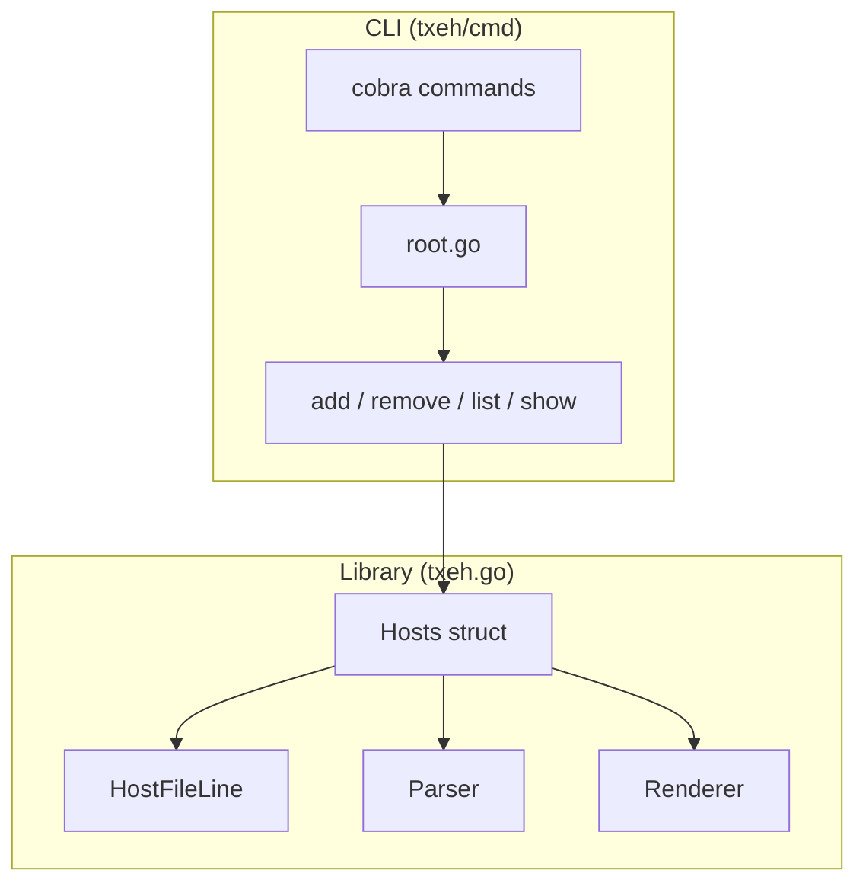

# Architecture

## Components



## Library

The core library is a single file: `txeh.go`.

### Hosts Struct

The main entry point. Wraps a parsed hosts file with mutex protection for thread safety.

```go
type Hosts struct {
    sync.Mutex
    Path          string
    ReadFilePath  string
    WriteFilePath string
    hostFileLines HostFileLines
}
```

### HostFileLine

Represents a single line in the hosts file. Lines are categorized by type:

| Type | Value | Description |
|------|-------|-------------|
| `UNKNOWN` | 0 | Unrecognized line |
| `EMPTY` | 10 | Empty/whitespace line |
| `COMMENT` | 20 | Comment line (`# ...`) |
| `ADDRESS` | 30 | Host entry (`IP hostname [hostname...]`) |

### Parser

`ParseHosts` and `ParseHostsFromString` read a hosts file and produce a slice of `HostFileLine` structs. The parser:

- Preserves all lines (comments, empty lines, entries)
- Normalizes hostnames to lowercase
- Extracts inline comments from address lines
- Handles both IPv4 and IPv6 addresses

### Renderer

`RenderHostsFile` reconstructs the hosts file from the internal representation, preserving the original structure while reflecting any modifications.

## CLI

The CLI uses [Cobra](https://github.com/spf13/cobra) for command parsing. Each command is a separate file under `txeh/cmd/`.

### Command Tree

```
txeh
├── add           -- Add hostnames to an IP
├── remove
│   ├── host      -- Remove by hostname
│   ├── ip        -- Remove by IP address
│   ├── cidr      -- Remove by CIDR range
│   └── bycomment -- Remove by inline comment
├── list
│   ├── ip        -- List hosts for IPs
│   ├── cidr      -- List hosts in CIDR ranges
│   ├── host      -- List IPs for hostnames
│   └── bycomment -- List hosts by comment
├── show          -- Display full hosts file
└── version       -- Print version
```

## Thread Safety

All public methods on `Hosts` acquire a mutex before reading or modifying the internal state. This makes txeh safe for concurrent use, which is essential for tools like kubefwd that manage hosts entries from multiple goroutines.

## Cross-Platform Support

The default hosts file path is determined by platform:

| Platform | Path |
|----------|------|
| Linux / macOS | `/etc/hosts` |
| Windows | `%SystemRoot%\System32\drivers\etc\hosts` |
